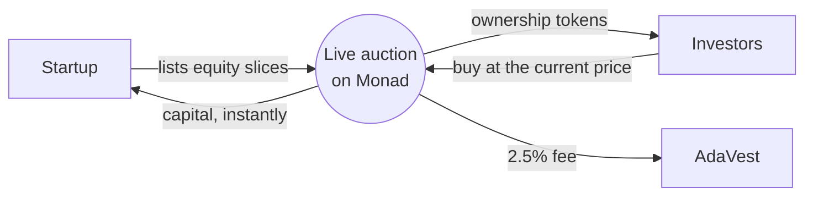

# AdaVest
A fast and simple way to invest in startups, built on Monad.

Startups sell equity in small slices (e.g. 10 × 1%) through **live Dutch auctions**. The price drops every second, the first investor to click **Buy** gets the slice, the founder is paid instantly, and the investor receives an ERC-1155 slice token. Built for **Monad Blitz İstanbul v2**.

```
contracts/   Foundry project: AdaVestAuction.sol + tests + deploy/seed scripts
web/         Next.js (App Router) + Tailwind + wagmi + viem frontend
```

## Live on Monad Testnet

| | |
|---|---|
| Contract | [`0xb5c11cE1F2Dd31145aE9374b515305c5a5573dAC`](https://testnet.monadvision.com/address/0xb5c11cE1F2Dd31145aE9374b515305c5a5573dAC) |
| Network | Monad Testnet (chain id `10143`) |

## Requirements

- [Foundry](https://getfoundry.sh) (`forge`, `cast`)
- Node.js 20+
- MetaMask with Monad Testnet and some MON from the [faucet](https://faucet.monad.xyz)

## Wallets

| Wallet | Role | Used as |
|---|---|---|
| AdaVest Platform | Deploys the contract, owner, receives the 2.5% fee | `PRIVATE_KEY` |
| Startup Wallet | Founder that opens rounds | `FOUNDER_PRIVATE_KEY` |
| Buyer 1 / Buyer 2 | Investors in the demo (MetaMask, two browsers) | — |

## How it works

AdaVest turns a startup funding round into a transparent, real-time onchain auction.



- **List:** A startup offers part of its equity as fixed-size slices, with a starting price and a price floor.
- **Discover:** The price declines continuously until investors step in, so valuation is set by the market, in the open.
- **Settle:** Every purchase settles in under a second. The investor receives an onchain ownership token and the startup receives funds immediately.

## 1. Contracts

From the repo root:

```bash
cd contracts
git submodule update --init --recursive   # first time only
forge test
```

Put your keys in the repo-root `.env` (never commit it; see `.env.example`):

```bash
PRIVATE_KEY=0x...            # AdaVest Platform wallet
FOUNDER_PRIVATE_KEY=0x...    # Startup Wallet
```

Deploy to Monad testnet (still inside `contracts/`):

```bash
set -a; source ../.env; set +a   # export the keys for forge
forge script script/Deploy.s.sol --rpc-url https://testnet-rpc.monad.xyz --private-key $PRIVATE_KEY --broadcast
```

Copy the printed `AdaVestAuction deployed at:` address into `.env` as `CONTRACT_ADDRESS`, then seed 3 demo rounds from the Startup Wallet (one starts 60 s after seeding):

```bash
set -a; source ../.env; set +a   # export the keys for forge
forge script script/Seed.s.sol --rpc-url https://testnet-rpc.monad.xyz --broadcast
```

Check the transactions at https://testnet.monadvision.com.

## 2. Frontend

From the repo root:

```bash
cd web
cp .env.local.example .env.local   # set NEXT_PUBLIC_CONTRACT_ADDRESS
npm install
npm run dev                        # http://localhost:3000
```

If you change the contract: `forge build` in `contracts/`, then `npm run sync-abi` in `web/`.

Pages:

- `/` shows the hero and the live rounds list.
- `/round/[id]` is the live auction: a 100 ms price ticker, a Buy button (+2% buffer, refunded), the live `SliceBought` feed, "Confirmed in X s", and the founder's balance updating live.
- `/create` is the form a founder uses to open a round.
- `/portfolio` shows the slices you own.

## Local testing (optional)

```bash
anvil --chain-id 10143
# Multicall3 is needed for batched reads; copy it from Monad testnet:
cast rpc anvil_setCode 0xcA11bde05977b3631167028862bE2a173976CA11 \
  $(cast code 0xcA11bde05977b3631167028862bE2a173976CA11 --rpc-url https://testnet-rpc.monad.xyz)
# deploy + seed with anvil keys against http://127.0.0.1:8545, then in web/.env.local:
# NEXT_PUBLIC_RPC_URL=http://127.0.0.1:8545
```

## Legal note

This is a prototype on testnet, not a securities offering. A production version would allow only KYC-verified investors, partner with an SPK-licensed equity crowdfunding platform, and back each slice token with a SAFE or similar agreement.
